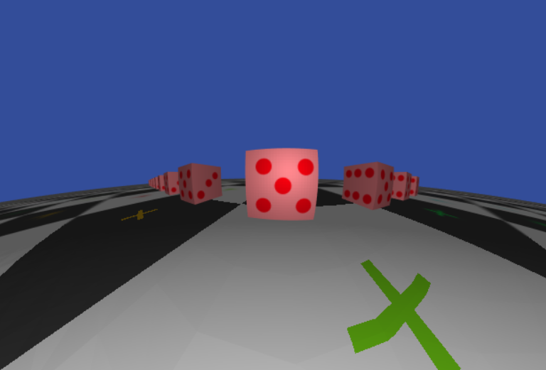

# special-relativity

This project shows how the geometry of the world looks under
special relativistic transformations. You can see a live demo
[here](https://harrygifford.github.io/special-relativity/). You can see effects such as Terrell rotation, Doppler shifting and the headlight effect. Note that the
page uses WebGL. If you cannot use WebGL, there is a video
[here](https://youtu.be/109s5HbdWs0).

Approaching a line of cubes at 95% of the speed of light. You can see the
geometric effects of [abberation](https://en.wikipedia.org/wiki/Relativistic_aberration) and [Terrell rotation](https://en.wikipedia.org/wiki/Terrell_rotation).

## Usage

Go to the live demo above. You can rotate with the mouse and you can move the
camera with the following keys:

| Key | Description    |
| --- | -------------- |
| `W` | Move forward.  |
| `A` | Move left.     |
| `S` | Move backward. |
| `D` | Move right.    |
| `E` | Move up.       |
| `Q` | Move down.     |

On cell phone you can use your thumbs to touch the screen and two virtual
joysticks will appear. You can then use these to move around.

You can also plug in a game controller and use the analog sticks to
move around.

### Options

When you open the page you will see a bunch of options. They are

**Max camera speed**: Maximum speed the camera can move at. Should be a number above 0 and below 1 where 1 corresponds to the speed of light.

**Relativistic beaming**: Shows the ["headlight effect"](https://en.wikipedia.org/wiki/Relativistic_beaming) where various effects cause the luminosity of
different objects to change with velocity.

**Doppler effect**: Shows the [Relativistic Doppler effect](https://en.wikipedia.org/wiki/Relativistic_Doppler_effect).

**Assume no light travel time**: Shows the geometry of the objects assuming no time delay. This requires us to assume a reference frame because the "now" slice will be different in different reference frames. There are two obvious choices:

- Camera: Assume the world is moving and the camera is at rest. This means the world will look
  compressed in the direction perpendicular to the direction of motion.
- World: Assume the world is at rest and the camera is moving. In this case the camera's sensor is length contracted, but the light entering the camera is not. This means objects will appear stretched because the light from an object will be spread over a larger portion of the sensor.

**Assume fixed camera speed**: Assumes the camera is moving forward a fixed velocity relative to the environment but without actually moving the camera.

**Use Galilean relativity**: Assumes no special relativity. Note that the rasterizer won't render things correctly for speeds greater than the speed of light.

## Development

There is one main package, although it is structured as a mono-repo so that
it's easy to add new packages. You will find the main project under
`packages/frontend`.

First run `pnpm install` to install all the dependencies and then go to
`packages/frontend` and run `pnpm run start` to load the page.

The directory `utils` contains packages related to development or that
only need to be built/executed infrequently. For example
`wavelength-color-map` is used to generate the texture for mapping
Doppler shifted colors.

## Overview

The code is under `packages/frontend`.

This project uses [babylonjs](https://www.babylonjs.com/) to provide a basic
engine and to load the GLTF model.

`static/main.vert` is the GLSL shader that applies the Lorentz transform
to the vertices.

`static/frag.glsl` is a basic diffuse shader. Nothing special in here.

`src/camera.ts` contains code to control the camera and how quickly it speeds
up and slows down so that the acceleration is smooth. I decided to work in
proper velocity instead of regular velocity since it made for smoother motion.

## Sources

I used the fantastic [Relativity visualized](https://www.spacetimetravel.org/tompkins/tompkins.html) site to get a better understanding and for the idea of rendering a bunch of dice.

See [Chapter 4 of Daniel Weiskopf's dissertation](https://publikationen.uni-tuebingen.de/xmlui/bitstream/handle/10900/48159/pdf/01dissertation.pdf) for a great and detailed treatment.

## Known issues

- The camera's acceleration is ad hoc. I want a simple way to make the camera
  speed up to a maximum velocity in the direction of movement when a key is
  pressed and then slow down to a stop when the key is released.

- The normals are not transformed correctly with a moving light source, so as a work-around I compute
  the normals from scratch in the fragment shader. I tried to get it to work
  using the inverse-transpose of the Lorentz matrix, but couldn't figure out
  the issue.

- No doppler effect or aberration of light. Would be great to have.

- Shading model is very basic. It would be nice to support normal maps,
  specular highlights and environment maps. Perhaps this can be done within
  BabylonJS?

- No support for users opening their own models without modifying the code.
  Two things here: first is adding a UI for opening a GLTF file and then
  passing it to the babylon loader. The second is to subdivide large triangles
  automatically so that straight surfaces transform correctly.

## Contributions

Feel free to open a PR or issue (either for bugs, features or questions) and
I will review when I can.
